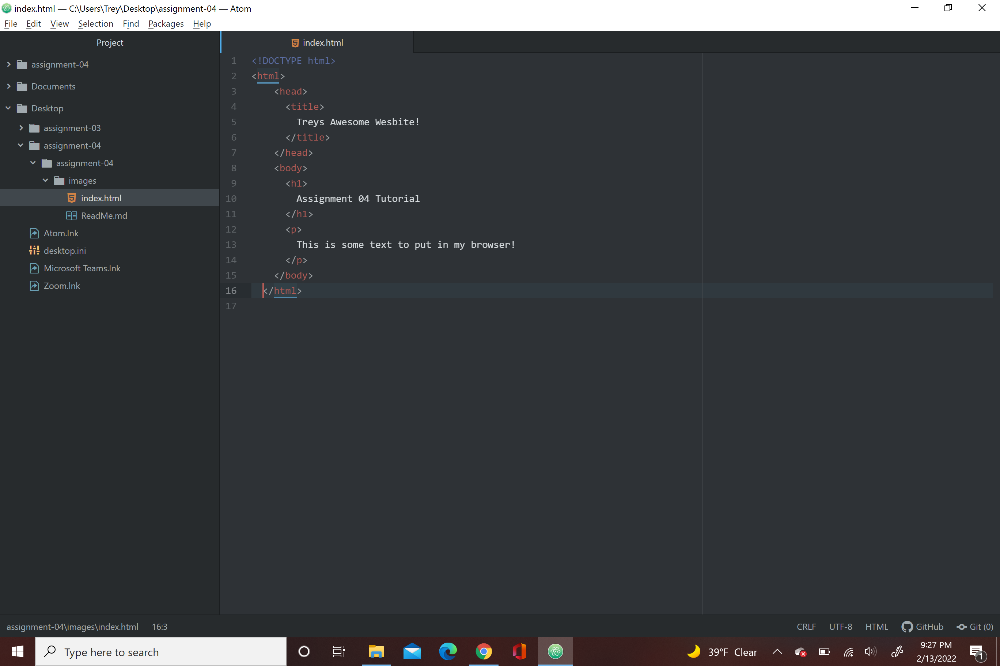

1. Browsers function by a series of codes put together and sent to it the Network to help put a page or interface together. A rendering engine helps construct the page you see. Programing language Javascript helps put everything together in a common language . I usually use google chrome to surf the web.

 
