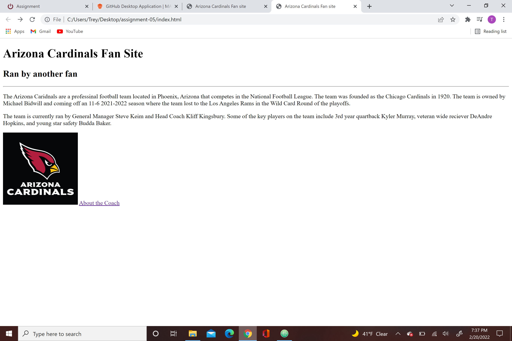

I visited a few websites that I visit on a fairly daily basis today, ESPN and NFL.com. It was interesting to see how the design of the website changed from the early 2000's (2004 and 2009) to how the websites currently look today. Some of the old designs I think I prefer but that might be for mainly nostalgic reasons. The websites all look much more modern now in terms of the text used on the website and bright colors throughout the site.
