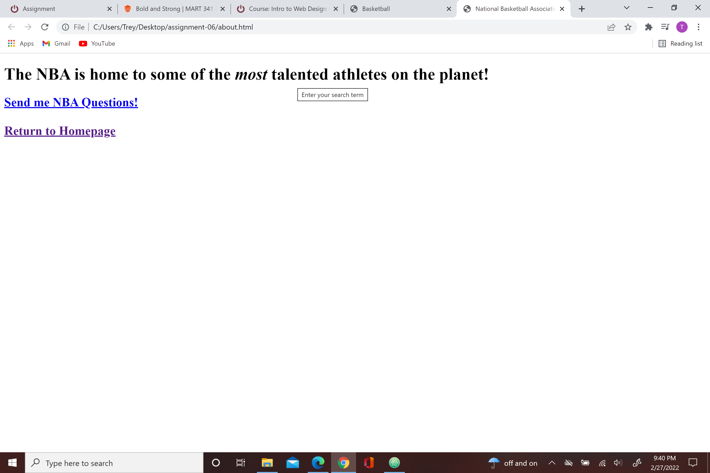

The main differences between semantic markup and structuralcutral markup is that semantic markup really helps you edit the actual text and titles of what your website displays. structural markup actually gives you the design of the website and how the website looks.
