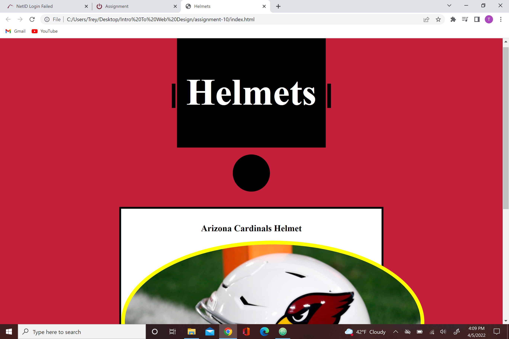

The difference between universal, element, class, and id selector types is when you would chose to use them. They all have different times when they would be used best.
I chose my colors based on my favorite football team, the Arizona Cardinals
