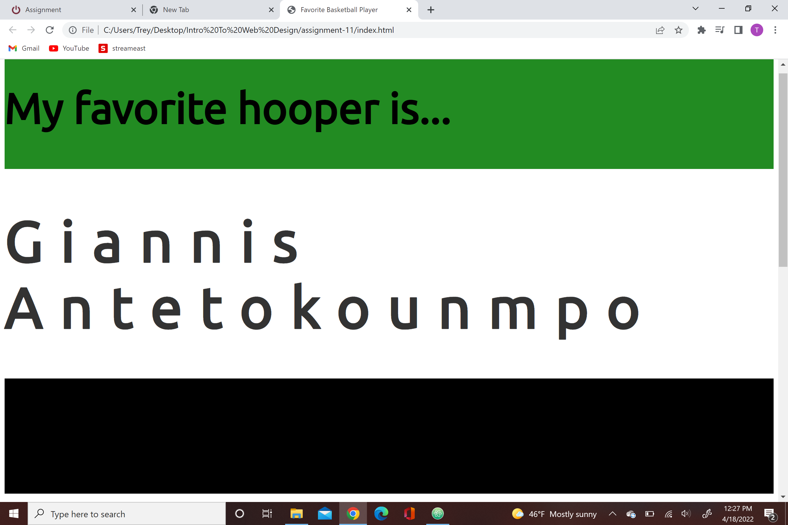

Typography can be described a the art of arranging letters and text in a way that makes it legible, clear, and visually appealing
Your browser will always have a font that is the main one your using for your site as long as you have a fallback font.
Web fonts are not installed on all operating systems and devices, some must be web-safe too depending on he programing you're using 
