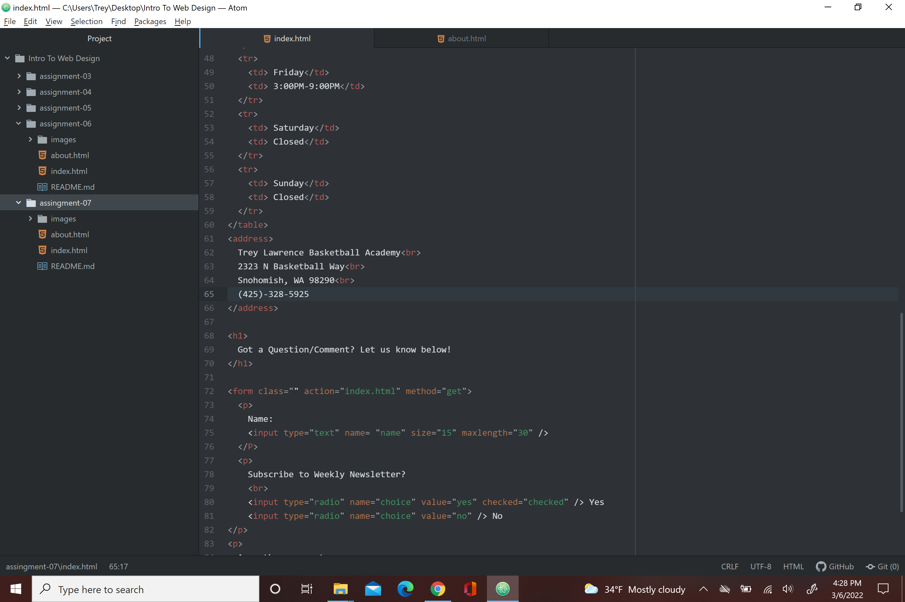

I think usually when I come across forms on webpages they are usually to gather information from website visitors like comments or questions they might have. Other times I can remember seeing a lot of formers on websites is when I was in High school and would have to sign up for different basketball tryouts or tournaments but again those were just different ways to collect various information they needed about me 
