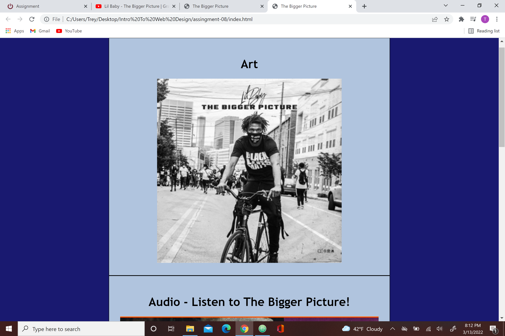

An affordance can best be described as a clue as to how an object should be used, usually by the object itself or context around it. For example, speaker icon being used for volume.
I think some of the advantages to using a third party host for your videos is how many more videos your able to access and use by using those sites, but a big negative from that is that the videos could come off the host site at anytime then you would be left with an unusable video on your website.
